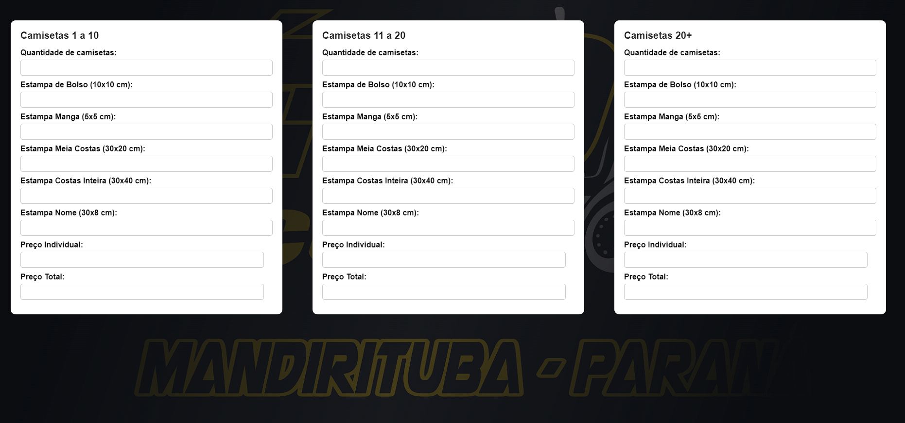

# eto-acessorios

## Descrição
A página Éto Acessórios é um projeto de umna empresa que trabalhei para facilicar o orçamento de camisetas que era feito por uma planilha no Excel e agora é feito online. Este projeto foi desenvolvido como parte do meu aprendizado em desenvolvimento web.

## Funcionalidades Principais
- Orçamento para confecção de camisetas

## Tecnologias Utilizadas
- HTML5
- CSS3
- JavaScript
- Git (para controle de versão)

## Como Utilizar
1. Clone o repositório (`git clone https://github.com/AngeloHervis/eto-acessorios.git`).
2. Abra o arquivo `index.html` em seu navegador web.
3. Obrigatório colocar "0" nos campos que não forem preenchidos.

## Autor
Angelo Hervis
- GitHub: [AngeloHervis](https://github.com/AngeloHervis)
- LinkedIn: [Angelo Hervis](https://www.linkedin.com/in/angelo-hervis/)
